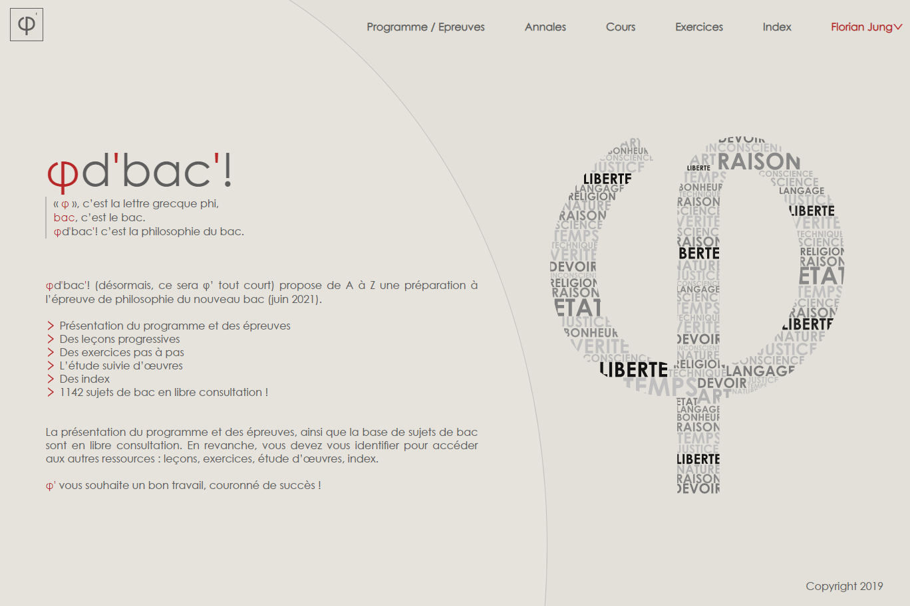
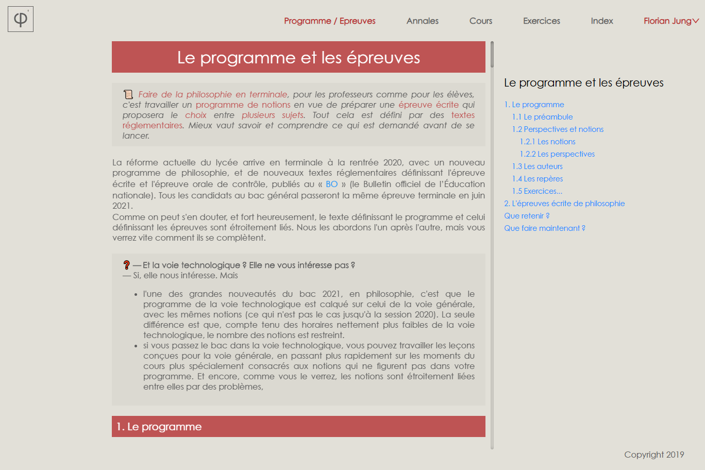
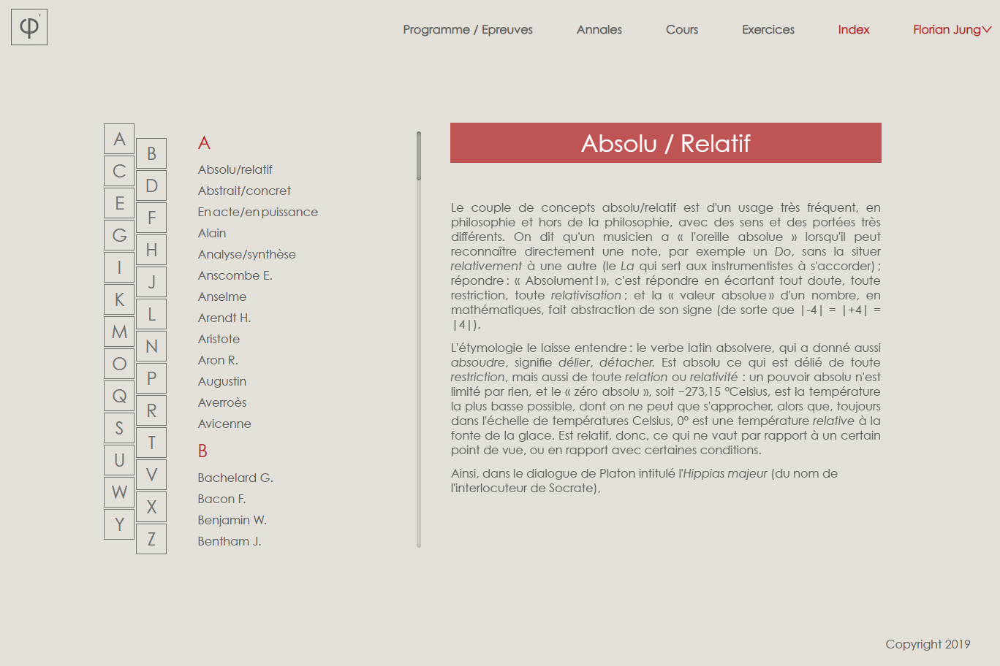
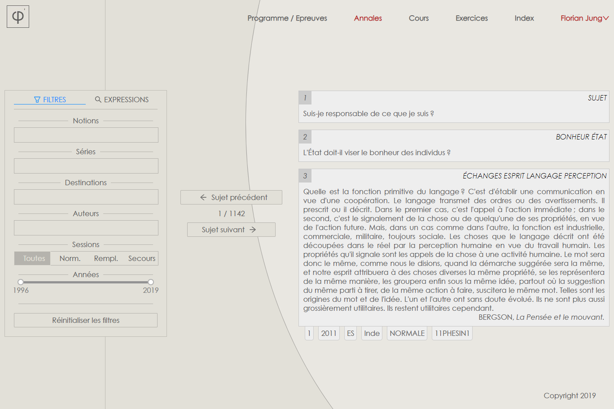

<h1 align="center">Phidbac.fr</h1>

Version NextJS + Typescript

  

 

## Phidbac.fr

<a href="https://phidbac.fr">Phidbac.fr</a> est un site web dédié à la préparation de l'épreuve du baccalauréat de philisophie de 2021. Des cours et des exercices sont disponibles, et appuyés par des outils spécifiques, tels qu'un index répertoriant les Notions, Auteurs, Conecpts importants, et une base de tous les sujets publiés depuis 1996 (disponible en application Android et IOS sur <a href="https://github.com/guarn/phidbac-flutter">Phidbac-Flutter</a>).

La gestion complète du site est délégue à un CRM créé sur mesure : <a href="https://github.com/guarn/phidadmin">PhidAdmin</a>.
Ce CRM intègre notamment un éditeur de texte poussé pour la rédaction et la gestion des cours, exercices, index,et sujets.

## Technos

Nextjs + Typescript + ServiceWorkers + Antd + Express